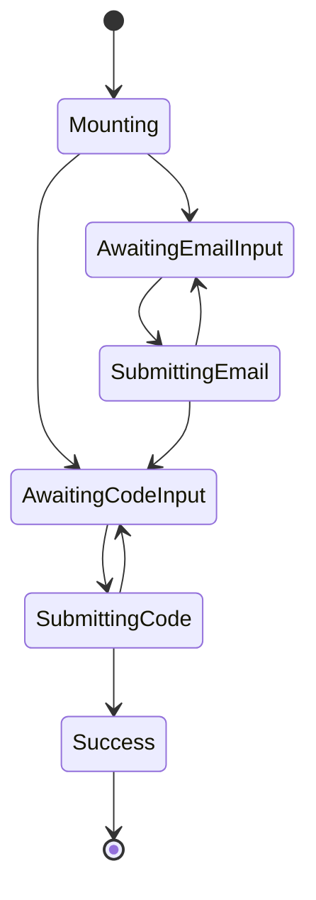

> 그런데 이 패턴이 "상태 머신"처럼 들린다면 놀랄 일도 아닙니다. 선택은 실제로 상태 머신을 구축하느냐 마느냐가 아니라 암시적으로 구축하느냐 명시적으로 구축하느냐의 문제입니다.
>
> https://massimilianomirra.com/notes/expressive-components-in-vanilla-react-part-1-type-states

