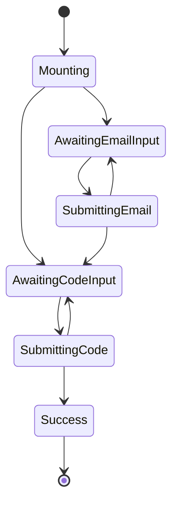

import { Blockquote } from '@components/Blockquote'

<Blockquote
  cite={{
    url: 'https://massimilianomirra.com/notes/expressive-components-in-vanilla-react-part-1-type-states',
    title: 'Expressive components in vanilla React, part 1: TypeStates',
  }}
>
  이 패턴이 "상태 머신"처럼 들린다면, 그리 놀랄 일도 아닙니다. 결국, 선택의
  문제는 상태 머신을 구축할지 말지가 아니라, 그것을 암시적으로 구축할지
  명시적으로 구축할지에 달려 있습니다.
</Blockquote>

