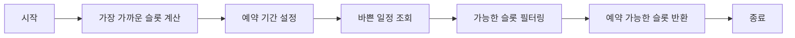
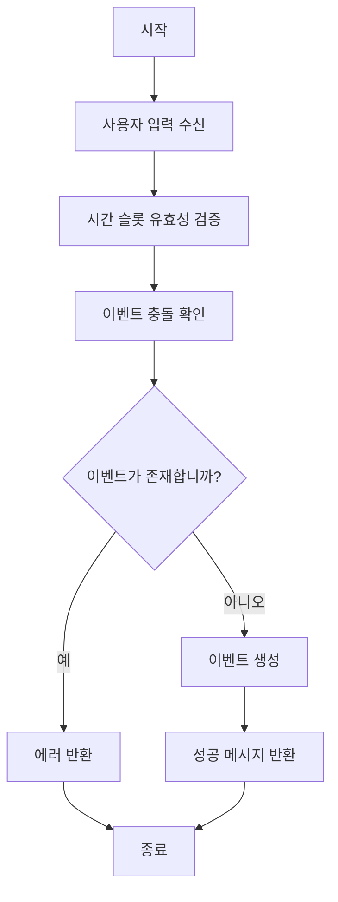

## `fetchAvailability` 시간 슬롯 조회

지정된 조건(근무 요일, 시간, 이벤트 충돌 여부)에 따라 예약 가능한 시간 슬롯을 가져옵니다. 결과는 사용자에게 제공할 수 있는 예약 가능한 시간 슬롯 목록과 해당 시간 슬롯의 지속 시간(분 단위)입니다.

1. 현재 시간을 기준으로 가장 가까운 시간 슬롯을 계산합니다. (슬롯 길이는 `TIMESLOT_DURATION`에 따라 설정됩니다.)
2. 28일(`DAYS_IN_ADVANCE`) 동안의 일정 기간을 설정합니다.
3. `Calendar.Freebusy.query`를 사용하여 지정된 캘린더(`CALENDAR`)의 바쁜 일정(busy events)을 조회합니다.
4. 조회된 이벤트를 기반으로 조건에 맞지 않는 시간 슬롯을 제외합니다:
   - 지정된 근무 시간(`WORKHOURS.start`, `WORKHOURS.end`) 외의 시간.
   - 근무일(`WORKDAYS`)이 아닌 요일.
   - 다른 이벤트와 시간이 겹치는 경우.
5. 예약 가능한 시간 슬롯을 ISO 8601 형식의 문자열로 저장하고 반환합니다.

## `bookTimeslot` 시간 슬롯 예약

사용자가 선택한 시간 슬롯에 이벤트를 생성하여 예약합니다. 예약이 성공하면 Google Calendar에 이벤트를 추가하고 사용자에게 확인 메시지를 반환합니다.

1. 사용자가 선택한 시간 슬롯(`timeslot`)과 추가 정보(이름, 이메일, 전화번호, 메모)를 인수로 받습니다.
2. 시간 슬롯의 유효성을 검증하고, `TIMESLOT_DURATION`을 기준으로 종료 시간을 계산합니다.
3. `Calendar.Freebusy.query`를 통해 선택한 시간 동안 다른 이벤트가 있는지 확인합니다.
   - 이벤트가 겹치면 예약이 불가능하다는 에러 메시지를 반환합니다.
4. 겹치는 이벤트가 없다면, `CalendarApp.getCalendarById`를 사용하여 Google Calendar에 새로운 이벤트를 생성합니다:
   - 이벤트 제목: 사용자 이름이 포함된 약속 제목.
   - 이벤트 설명: 전화번호와 메모를 포함합니다.
   - 초대된 손님: 제공된 이메일로 초대합니다.
   - 초대 메일 발송(`sendInvites: true`).
5. 예약 성공 여부를 메시지로 반환합니다.

## 사용 플로우 및 사례

1. 사용자가 예약 가능한 시간 조회: 사용자는 시스템에 접속하여 자신의 예약 가능 시간을 확인합니다. 이는 캘린더 기반 예약 시스템에서 Google Calendar와 동기화하여 관리됩니다.
2. 사용자가 특정 시간에 예약: 사용자가 특정 시간을 선택하면,

   - 선택된 시간과 정보를 `bookTimeslot`에 전달하여 캘린더 이벤트가 생성됩니다.
   - 충돌이 없을 경우, 예약이 성공적으로 완료되며 이벤트 초대 이메일이 사용자의 메일로 전송됩니다. 이 과정은 이메일 알림으로 사용자가 이벤트에 초대받음을 알려줍니다.

3. 자동화: 시스템은 특정 근무 시간과 일정을 고려하여 예약 가능성을 실시간으로 확인합니다. 사용자는 이를 통해 보다 효율적으로 예약을 진행할 수 있습니다.

---

- https://github.com/rbbydotdev/someday
